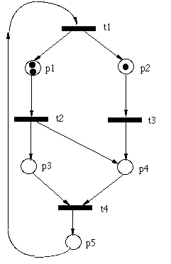

# Find Petri Net Characteristics In Java

The **project subject** can be found in **CA1.pdf** but it is in Persian \
This project was Computer Assignment 1 (CA1) for the course: **Real-Time & Embedded Systems**.

Here is the subject of the project in English:

> Write a program that reads the content of a text file consists of a **Petri-net** characteristics, then show that the Petri net is safe and live by using matrix multiplication.

Here is an example of the text file syntax:

```
P=(p1,p2,p3,p4,p5)
M0={2,1,0,0,0}
T=(t1,t2,t3,t4)
F={(p5,t1),(t1,p1),(t1,p2),(p1,t2),(p2,t3),(t2,p3),(t2,p4),(t3,p4),(p3,t4),(p4,t4),(t4,p5)}
```

---

## Documentation

This project is codded in **VScode** by using **Java**. \
There are pretty good comments in the codes.

If you don't know about Petri net Incident Matrices, I suggest you take a look [here](https://www.techfak.uni-bielefeld.de/~mchen/BioPNML/Intro/MRPN.html) at first.

There is a **complete documentation** in *Persian* in the file named: **description.pdf**

### Hierarchy Of Files

- **CA1.java**:  (Main file)
- **Petrinet.java**:  (Method & fields for Petrinet)
- **IncidentMatrix.java**:  (Interface implemented in Petrinet class)
- **Matrix.java**:  (Matrix calculations)
- **Petrinet.txt**:  (Raw Petrinet example data)

---


